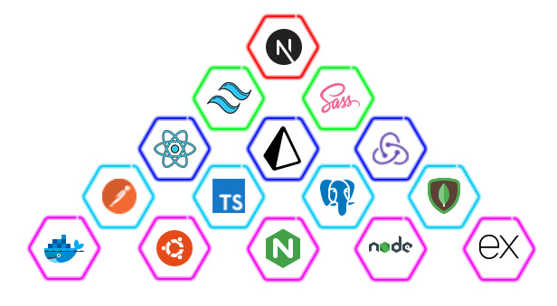

# I'm FUll-stack_developer and I'm strong like SHAZAM⚡

### My name is Jack Lee. I have been doing web development for more than 10 years, and at the moment I am most interested in PERN-stack development!
### Цель обучения - не знания, а решение практических, конкретных задач - иначе мотивация иссякнет!

<h1 align="center">Hi 👋, I'm Jack Lee - FUll-stack_developer and I'm strong like SHAZAM⚡</h1>

# 💫 About Me:
🌱 I’m currently learning ICP Development 📝 I regularly write articles on https://medium.com/@mertenercan 📫 How to reach me mertenercan@gmail.com ⚡ And also I love cats. A lot.

## 🌐 Socials:

# 💻 Tech Stack:
                           	  

---

<!-- Proudly created with GPRM ( https://gprm.itsvg.in ) -->
